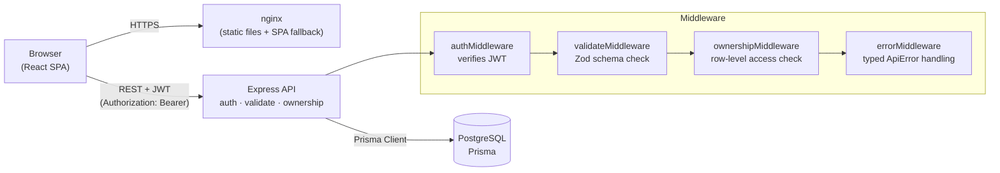

# QuestLog

A gamified habit tracker. Turn daily routines into quests, earn XP, level up, build streaks, and watch a year-long consistency heatmap fill in.

**Live demo:** https://questlog-web.fly.dev
**API:** https://questlog-api-snowy-seastar-7669.fly.dev

---

## Stack

| Layer | Tech |
|---|---|
| Frontend | React 18, Vite, TypeScript, Tailwind CSS, TanStack Query, react-hook-form, Zod |
| Backend | Node 20, Express, TypeScript, Prisma ORM, Zod validators |
| Database | PostgreSQL 16 |
| Auth | JWT (HS256), bcryptjs password hashing |
| Shared | `@questlog/shared` workspace — Zod schemas reused on both sides |
| Infra | Docker, Fly.io (3 apps: web + api + managed Postgres) |
| CI | GitHub Actions — lint, typecheck, unit + integration tests |

## Architecture



**Request flow:** Browser sends `Authorization: Bearer <jwt>` → Express verifies the token, validates the request body against a Zod schema, checks the authenticated user owns the target row, then delegates to a service which calls Prisma.

**Why a shared package:** the same Zod schemas validate the API request on the server and the form fields on the client, so the two can never drift.

## Features

- **Quests** — create daily / weekly / monthly / one-time goals, assign categories, set difficulty (Easy → Legendary) and XP reward (5–100).
- **XP + levels** — completions award XP; level curve is `floor(1 + sqrt(totalXP / 50))`.
- **Streaks** — current and best per-quest, computed from the entries log.
- **Dashboard** — today's quests, XP progress bar, 30-day completion chart, 365-day consistency heatmap, recent activity feed, top-line stats with colored accents.
- **Analytics** — completion trend, category breakdown.
- **History** — paginated entries with cursor-based pagination.
- **25 REST endpoints** across auth, quests, categories, entries, dashboard, analytics.

## Local development

```bash
# clone & start the dev stack (Postgres + API + Vite, all hot-reloaded)
git clone https://github.com/Prabh54/questlog.git
cd questlog
docker compose -f docker-compose.dev.yml up
```

Then open http://localhost:5173 and register an account. First boot is slow (~60s — each container does `npm install`); restarts are fast (deps cached in named volumes).

### Seed demo data

```bash
cd backend
npm install
npx prisma generate
npm run db:seed
```

The seed populates the user `harpreet@gmail.com` with 4 categories, 8 quests, and 90 days of realistic entries (varied completion patterns, streaks, abandoned quests, weekly cadences). It throws if the user doesn't exist — register first.

### Run tests

```bash
npm run --workspace=@questlog/backend test
npm run --workspace=@questlog/frontend test
```

## Environment variables

### Backend (`backend/.env`)

| Var | Required | Default | Notes |
|---|---|---|---|
| `DATABASE_URL` | yes | — | `postgres://` or `postgresql://` URL |
| `JWT_SECRET` | yes | — | ≥ 32 characters |
| `PORT` | no | `3001` | |
| `NODE_ENV` | no | `development` | `development` \| `production` \| `test` |
| `CORS_ORIGIN` | no | `http://localhost:5173` | comma-separated list |

Validated at boot via Zod ([`backend/src/config/env.ts`](backend/src/config/env.ts)) — the server refuses to start with a bad config.

### Frontend (`frontend/.env`, baked in at build time)

| Var | Required | Default | Notes |
|---|---|---|---|
| `VITE_API_URL` | yes | — | e.g. `http://localhost:3001` or the deployed API URL |

## Project layout

```
questlog/
├── backend/        Express API
│   ├── prisma/     schema, migrations, seed
│   └── src/        controllers · services · routes · middleware · validators
├── frontend/       React app
│   └── src/        features · components · services · lib · pages
├── shared/         @questlog/shared — Zod schemas used by both sides
├── docker-compose.dev.yml
├── fly.backend.toml
└── fly.frontend.toml
```

## Deployment

Both apps deploy to Fly.io:

```bash
flyctl deploy --config fly.backend.toml
flyctl deploy --config fly.frontend.toml
```

`VITE_API_URL` is passed as a Docker build arg in [`fly.frontend.toml`](fly.frontend.toml) so the API URL is baked into the production JS bundle.

## CI

GitHub Actions ([`.github/workflows/ci.yml`](.github/workflows/ci.yml)) runs on every push:

- Lint (ESLint) — backend, frontend, shared
- Typecheck (`tsc --noEmit`) — backend, frontend, shared
- Unit tests (Jest) — backend services
- Integration tests (Jest + supertest + real Postgres) — backend API routes
- Component tests (Vitest + React Testing Library) — frontend

## License

MIT
